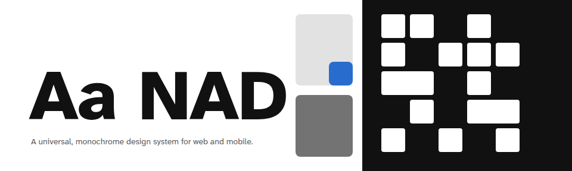
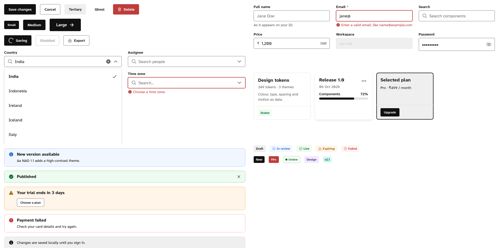

<picture>
  <source media="(prefers-color-scheme: dark)" srcset="docs/img/cover-dark.png">
  
</picture>

# Aa NAD Design System

**A universal, monochrome, accessibility-first design system for web and mobile, written so that designers, developers and AI coding agents can all follow it.**

- **3 themes:** light, dark and high contrast (WCAG AAA). Every text pair is checked in code.
- **45 React components** with all states, keyboard support and screen-reader behaviour.
- **249 design tokens:** an 8px grid, 4px corners, Atkinson Hyperlegible type, a 12-hue palette and a swappable brand ramp.
- **Calm, precise motion** that respects `prefers-reduced-motion`.
- **Assets:** Module Aa logo, Ionicons 8 (515 glyphs, outline and filled), 15 illustrations and 8 illustrated avatars.
- **Figma:** a plugin that builds an editable library with variables, styles and component variants.

[Live docs](https://Yogesh2806.github.io/aa-nad-design-system/) · [Brand book](guides/00-brand-book.md) · [Accessibility](guides/01-accessibility.md) · [Mobile](guides/02-mobile.md) · [Motion](guides/06-motion.md) · [Figma plugin](figma-plugin/README.md)



## Quick start (no build step)

```html
<!doctype html>
<html data-theme="light"> <!-- light | dark | high-contrast -->
<head>
  <link rel="stylesheet" href="tokens/tokens.css">
  <link rel="stylesheet" href="dist/aa-nad.css">
  <script src="https://cdn.jsdelivr.net/npm/react@18/umd/react.production.min.js"></script>
  <script src="https://cdn.jsdelivr.net/npm/react-dom@18/umd/react-dom.production.min.js"></script>
  <script src="dist/aa-nad.js"></script>
</head>
<body>
  <div id="app"></div>
  <script>
    const { Button, TextField, ToastProvider } = window.AaNAD, h = React.createElement;
    ReactDOM.createRoot(document.getElementById('app')).render(
      h(ToastProvider, null,
        h(TextField, { label: 'Email', type: 'email' }),
        h(Button, { variant: 'primary' }, 'Continue')));
    AaNAD.watchSystemTheme(); // follow the OS: dark, or high contrast when "increase contrast" is on
  </script>
</body>
</html>
```

You can load the files straight from GitHub through jsDelivr: `https://cdn.jsdelivr.net/gh/Yogesh2806/aa-nad-design-system@v1.2.0/dist/aa-nad.js` (and `/dist/aa-nad.css`, `/tokens/tokens.css`).

## What's inside

| Folder | Contents |
|---|---|
| `tokens/` | `tokens.json` (the source of truth), `tokens.css` (CSS custom properties for all three themes), `aa-nad.figma-tokens.json` (W3C format for Tokens Studio) |
| `dist/` | `aa-nad.js` (React components as `window.AaNAD`), `aa-nad.css`, `aa-nad.d.ts` (types) |
| `src/` | TypeScript/React source. Rebuild with `npm install && npm run build` |
| `components/` | One guide per component: when to use it, what you provide, accessibility, mobile |
| `guides/` | Brand book, accessibility, mobile (iOS and Android), content, checklist coverage, contributing, motion |
| `assets/` | Logos, icons, illustrations, avatars, fonts |
| `figma-plugin/` | Builds the editable Figma library |
| `docs/` | The GitHub Pages site |

## Components

**Actions:** Button, IconButton, Link
**Forms:** TextField, TextArea, Select, Combobox, MultiSelect, FileUpload, Checkbox, RadioGroup, Switch, Slider, SegmentedControl
**Date:** Calendar, DatePicker
**Data display:** Badge, Tag, Avatar, Card, Divider, List, Table
**Media:** Icon, Image, Carousel
**Feedback:** Alert, Toast, Tooltip, Spinner, BlockLoader, ProgressBar, Skeleton, EmptyState
**Overlays:** Modal, Drawer, BottomSheet, Menu
**Navigation:** Tabs, Accordion, Breadcrumbs, Pagination, Stepper, NavBar, TabBar

## Bring your own brand

Replace the 11 `primary-*` tokens with your colour ramp. Every action token follows, while the logo and status colours stay as they are. See [Colour](guides/00-brand-book.md#colour).

## For AI coding agents

Start with [`guides/00-brand-book.md`](guides/00-brand-book.md), then the component's guide in `components/`. Use token names (`var(--space-16)`), never raw values. Theme with `data-theme` only.

## Licenses

- Code, tokens and docs: [MIT](LICENSE)
- Logo, illustrations, avatars and the generated Figma library: [CC BY 4.0](LICENSE-ASSETS.md)
- Fonts: OFL 1.1 · Ionicons: MIT. See [third-party notices](THIRD-PARTY-NOTICES.md)

Made by **Yogesh Jeevan**. Contributions welcome: see [CONTRIBUTING](CONTRIBUTING.md). Maintainers: see [PUBLISHING](PUBLISHING.md) for releasing to GitHub and Figma Community.
